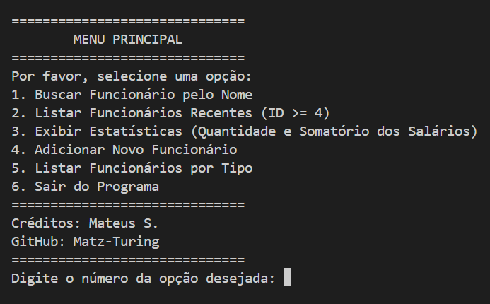

# Sistema de Gerenciamento de Funcionários 

Este é um programa em C# que oferece um conjunto de funcionalidades para gerenciar registros de funcionários de forma eficiente. O sistema permite realizar diversas operações relacionadas às informações e estatísticas dos funcionários.

## Funcionalidades

1. **Buscar Funcionário por Nome:**
    - Permite buscar um funcionário pelo nome completo.
    - Exibe os detalhes do funcionário se encontrado, ou uma mensagem caso não haja um funcionário correspondente.

2. **Listar Funcionários Recentes:**
    - Filtra e lista os funcionários com um ID maior ou igual a 4.
    - Ordena a lista por salário em ordem decrescente.

3. **Visualizar Estatísticas dos Funcionários:**
    - Exibe o número total de funcionários.
    - Mostra o somatório total dos salários de todos os funcionários.

4. **Adicionar Novo Funcionário:**
    - Permite adicionar um novo funcionário com detalhes como ID, nome, salário, data de admissão e tipo.
    - Valida a entrada para garantir que o salário seja maior que zero e a data de admissão não esteja no futuro.

5. **Listar Funcionários por Tipo:**
    - Filtra e lista funcionários com base em seu tipo (por exemplo, gerente, assistente).
    - Oferece uma entrada numérica para selecionar o tipo de funcionários a serem exibidos.

## Linguagem de Programação

O projeto está implementado em C#, utilizando o framework .NET para compilar e executar o código.

## Como Usar

1. **Clone o Repositório:**
    - Clone este repositório para sua máquina local usando Git.
    - Exemplo: `git clone https://github.com/SeuUsuario/SistemaGerenciamentoFuncionarios_CSharp.git`

2. **Compile e Execute:**
    - Abra o projeto em um IDE compatível com C# ou use um compilador C# para construir o projeto.
    - Execute a aplicação compilada para interagir com o menu e acessar as funcionalidades disponíveis.

3. **Interaja com o Menu:**
    - Siga os prompts no menu do console para realizar diversas operações, como adicionar funcionários, buscar por nome e visualizar estatísticas.

## Demonstração do Projeto

Este projeto demonstra conceitos básicos de gerenciamento de registros de funcionários, incluindo validação de dados, filtragem e relatórios. Mostra o uso de coleções e LINQ para manipulação e consulta de dados de funcionários.

## Créditos

Desenvolvido por Mateus S.  
GitHub: [Matz-Turing](https://github.com/Matz-Turing)
